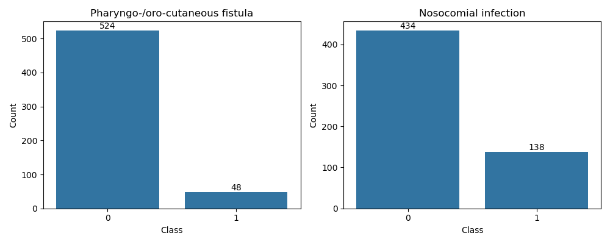
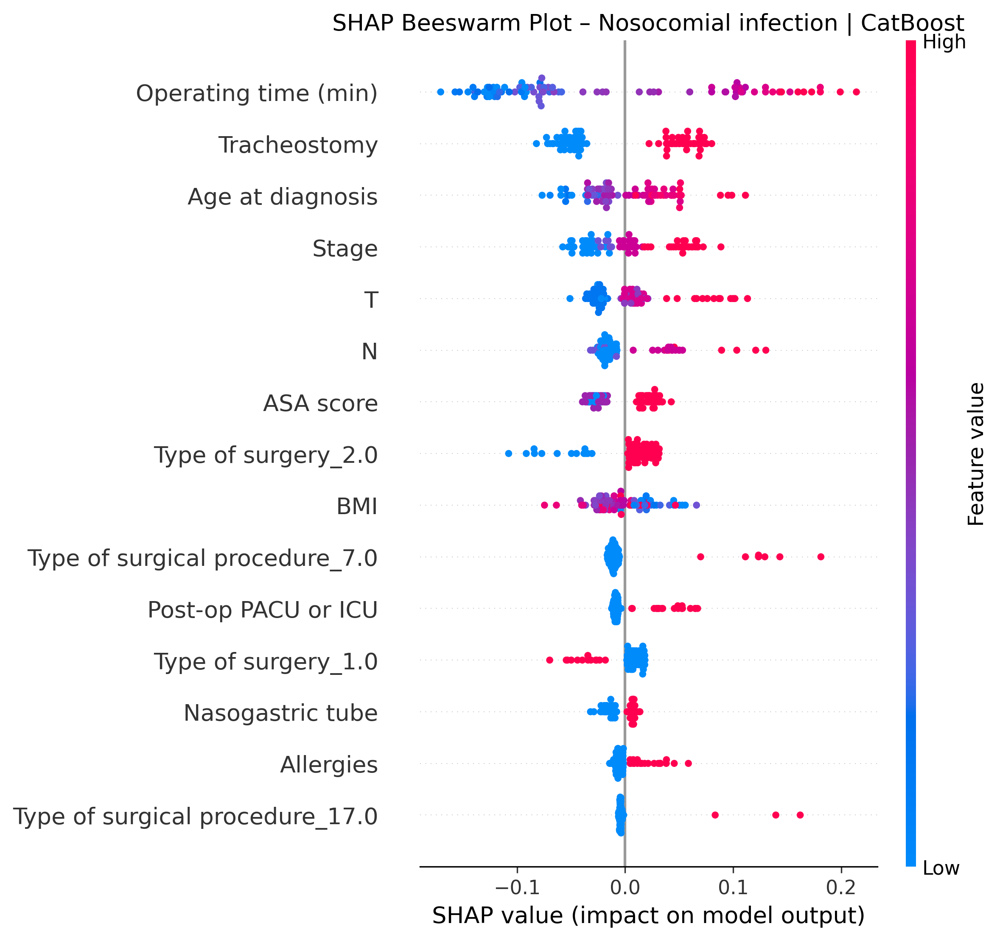
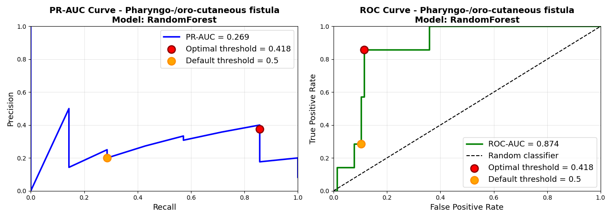

# 2026-P6-ENT-icipate

## Project Overview

**ENT-icipate** is a clinical project developed in collaboration with Molinette Hospital and supervised by LINKS Foundation. The aim is to predict two major post-surgical complications in patients undergoing ENT (Ear-Nose-Throat) tumor removal surgery using machine learning models:

- **Pharyngo-/oro-cutaneous fistula**
- **Nosocomial infection**

The models uses demographic (e.g., age, sex, weight), preoperative, and perioperative clinical data to estimate each patient’s risk of complications. This supports clinicians in risk stratification, early intervention, and resource planning. The project adopts a safety-first strategy, prioritizing sensitivity to ensure that high-risk patients are identified.

---


## Problem Formulation

This is framed as a binary classification problem, with strong class imbalance reflecting the real-world rarity of these complications. The model estimates the probability that a patient will develop either a pharyngo-/oro-cutaneous fistula or a nosocomial infection after surgery, based on the available clinical and demographic variables. Since missing a true complication (false negative) is considered more harmful than a false positive, the modeling objective emphasizes recall and F1-score for the positive class.

---

## Dataset Description

The dataset consists of clinical records from 574 patients who underwent ENT oncology surgery at a single tertiary-care center (2002–2023). Each patient is described by 64 features, grouped as follows:

- **Patient demographics and lifestyle:** age, sex, anthropometric measures, smoking and alcohol-related variables.
- **Comorbidities:** cardiovascular disease, diabetes, respiratory conditions, and other chronic illnesses.
- **Tumor and staging information:** TNM staging variables, originally in heterogeneous formats.
- **Surgical and operative characteristics:** type of procedure, reconstruction techniques, flap usage, and complexity indicators.

Two binary target variables are considered: pharyngo-/oro-cutaneous fistula and nosocomial infection.

*Note: The dataset (`Dataset_ENTicipate.xlsx`) is not included for privacy reasons.*

---

## Target Variable Distribution

The following figure shows the distribution of the two target variables (Pharyngo-/oro-cutaneous fistula and Nosocomial infection) in the dataset. This highlights the strong class imbalance, with complications being rare events compared to the majority of cases with no complication.



*The plot displays the count of positive and negative cases for each complication. The pronounced imbalance motivates the use of recall, F1-score, and PR-AUC as main evaluation metrics, and justifies the adoption of a safety-first threshold optimization strategy.*

---

## Data Preprocessing

The preprocessing pipeline includes:

- Detection and imputation of missing values (numerical and categorical)
- Standardization and encoding of categorical variables
- Correlation analysis and removal of highly correlated/redundant variables

---

## Handling Class Imbalance

Both complications are rare events, resulting in a strongly imbalanced class distribution. To address this:

- Stratified data splitting preserves class proportions across training, validation, and test sets
- Model evaluation focuses on minority-class metrics: recall, F1-score, and PR-AUC, ROC-AUC
- Threshold optimization prioritizes recall and F1-score for the positive class, minimizing false negatives

---

## Workflow

1. **Data Preparation:**  
   Data cleaning, imputation and feature selection.
2. **Model Development:**  
   everal machine learning models were trained (Logistic Regression, Random Forest, XGBoost, CatBoost). Hyperparameters were tuned using cross-validation, and the best models were selected based F1-score
3. **Evaluation:**  
   Assessment on a held-out test set using F1, PR-AUC, and other metrics.
4. **Interpretability:**  
   - **SHAP values** for feature importance and patient-level explanations.
   - **Threshold analysis** to understand the trade-off between sensitivity and specificity, supporting a safety-first clinical strategy.
   - **Additional plots - Signed Effect** for actionable insights, i.e. how changing a single feature affects the predicted class for each target
---

## Folder Structure

```
adsp_notebook.ipynb
README.md
model_results/
    plots/
    results_tables/
report/
Checkpoints/
```

- **adsp_notebook.ipynb**: Main notebook with code, analysis, and results.
- **model_results/**: Output directory for all results.
  - **plots/**: 
    - SHAP feature importance bar plots (`*_shap_bar.png`)
    - Beeswarm plots (`*_shap_beeswarm.png`)
    - Dependence plots (`*_shap_dependence.png`)
    - Signed Effect plots (`*_signed_effect.png`)
    - PR-AUC and ROC-AUC curves (`*_pr_roc_curves.png`)
  - **results_tables/**: 
    - Model performance summaries (`val_best_summary.csv`, `test_best_summary.csv`, `val_all_models.csv`)
    - Feature importance tables (`feature_importance_{target}.csv`)
    - Per-threshold metrics for each model (`{target}_{model}_val_metrics_by_threshold.csv`)
    - SHAP values per sample (`shap_values_{target}.csv`)

- **report/**: Final project report and documentation.
- **Checkpoints/**: Presentations slides.
- **README.md**: Provides an overview of the project, instructions, and documentation.

---

## Input

- **Dataset**: `Dataset_ENTicipate.xlsx` (not included)
    - 574 patients (2002–2023), 64 features (demographics, comorbidities, TNM staging, surgery details, etc.)

---

## Output

- **Predictions**: Final class (0 = no complication, 1 = complication) for both target complications per patient.
- **Results**: Saved in `model_results/`
---

## How to Use

1. Open `adsp_notebook.ipynb` in Jupyter or VSCode.
2. Place `Dataset_ENTicipate.xlsx` in the same folder as the notebook.
3. Run all cells in order. Results will be saved in `model_results/` and displayed in the notebook.

---

## Main Results

The table below summarizes the test set performance of the best models for each complication. All metrics are computed at the optimal threshold selected on the validation set.

| **Target**                    | **Best Model** | **Threshold** | **Accuracy** | **Precision** | **Recall (Sensitivity)** | **F1-score** | **PR-AUC** | **ROC-AUC** |
|-------------------------------|---------------|---------------|--------------|---------------|-------------------------|--------------|------------|-------------|
| Pharyngo-/oro-cutaneous fistula | RandomForest  | 0.42          | 0.87         | 0.38          | 0.86                    | 0.52         | 0.33       | 0.87        |
| Nosocomial infection           | CatBoost      | 0.38          | 0.80         | 0.57          | 0.76                    | 0.65         | 0.60       | 0.80        |

**Metric definitions:**
- **Accuracy:** Overall proportion of correct predictions.
- **Precision:** Proportion of predicted complications that are true (controls false positives).
- **Recall (Sensitivity):** Proportion of true complications correctly identified (minimizes false negatives).
- **F1-score:** Harmonic mean of precision and recall for the positive class.
- **PR-AUC:** Area under the Precision-Recall curve, primary metric for imbalanced data.
- **ROC-AUC:** Area under the ROC curve, overall discrimination ability.

*All results refer to the held-out test set. The optimal threshold was selected on the validation set to maximize F1-score for the positive class, then applied to the test set for final predictions.*

---

## Explainability of the results on the test set for the 2 best models and interpletation

#### SHAP Beeswarm Plot – Fistula


#### SHAP Beeswarm Plot – Nosocomial Infection



*Each dot represents a patient: the horizontal position shows how much that feature increases or decreases the predicted risk for that individual. The color indicates the feature value (red = high, blue = low).  
For example, in the fistula plot, longer operating times (red dots on the right) consistently increase risk, while lower values (blue dots) decrease it.  
Beeswarm plots reveal both average importance and the heterogeneity of feature effects across patients.*
 
#### PR-AUC and ROC-AUC Curves (Test Set)




*PR-AUC and ROC-AUC curves illustrate the models’ ability to distinguish between patients with and without complications.  
The red dot marks the threshold optimized on the validation set (maximizing F1-score), and the orange dot shows the default threshold (0.5).  
These plots demonstrate model performance on the test set using the threshold selected during validation, providing an unbiased evaluation.*

> **Note:** All results and thresholds refer to the test set; the optimal threshold was selected on the validation set and then applied to the test set.

---

# Reproducibility

Random seeds are set in the notebook for reproducibility. Results may vary slightly depending on hardware and library versions.

---

## Limitations & Future Work

- The dataset is from a single center and limited in size.
- No external validation set has been used.
- Future work: test on external datasets, integrate additional clinical variables, and explore advanced explainability methods.

---

**Authors**:  
- Alessandro Carrabs, Samesun Singh, XiaoQuan Ji  
- Collaboration: Molinette Hospital, LINKS Foundation

**License**: For academic and research use only.
