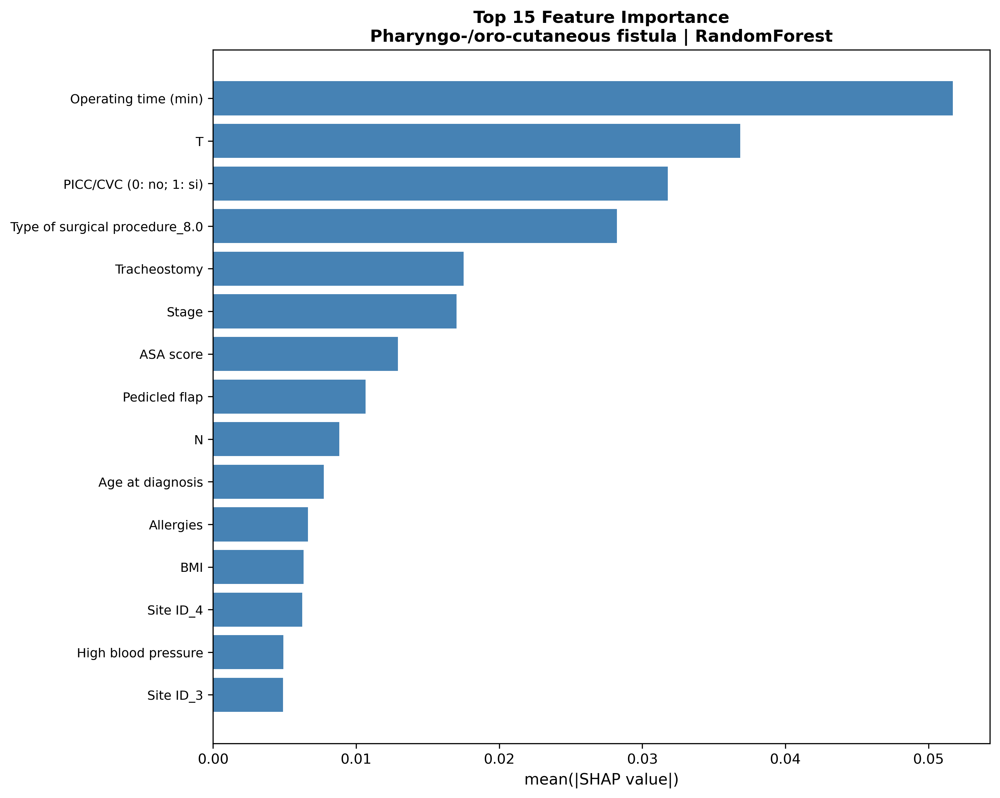
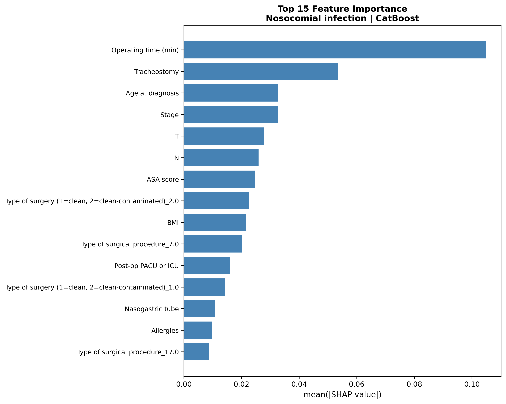

# 2026-P6-ENT-icipate

## Project Overview

**ENT-icipate** is a clinical project developed in collaboration with Molinette Hospital and LINKS Foundation. The aim is to predict two major post-surgical complications in patients undergoing ENT (Ear-Nose-Throat) tumor removal surgery using machine learning models:

- **Pharyngo-/oro-cutaneous fistula**
- **Nosocomial infection**

By leveraging preoperative and perioperative clinical data, the models estimate the probability of complications, supporting clinicians in risk stratification, early intervention, and resource planning. The project adopts a safety-first approach, prioritizing sensitivity to ensure high-risk patients are identified.

---

## Problem Formulation

The task is formulated as a binary classification problem, complicated by the rarity of the target complications (strong class imbalance). Given a set of pre-operative and peri-operative clinical variables, the model estimates the probability that a patient will develop either a pharyngo-/oro-cutaneous fistula or a nosocomial infection after surgery. Missing a true complication (false negative) is considered more harmful than a false positive, so the modeling objective emphasizes recall and F1-score for the positive class.

---

## Dataset Description

The dataset consists of clinical records from 574 patients who underwent ENT oncology surgery at a single tertiary-care center (2002–2023). Each patient is described by 64 features, grouped as follows:

- **Patient demographics and lifestyle:** age, sex, anthropometric measures, smoking and alcohol-related variables.
- **Comorbidities:** cardiovascular disease, diabetes, respiratory conditions, and other chronic illnesses.
- **Tumor and staging information:** TNM staging variables, originally in heterogeneous formats.
- **Surgical and operative characteristics:** type of procedure, reconstruction techniques, flap usage, and complexity indicators.

Two binary target variables are considered: pharyngo-/oro-cutaneous fistula and nosocomial infection.

---

## Data Preprocessing

The dataset exhibits heterogeneity in feature encoding, missing values, and redundancy. The preprocessing pipeline includes:

- Detection and imputation of missing values (numerical and categorical)
- Standardization and encoding of categorical variables
- Correlation analysis and removal of highly correlated/redundant variables
- Consistent application of preprocessing across training, validation, and test sets to avoid information leakage

---

## Handling Class Imbalance

Both complications are rare events, resulting in a strongly imbalanced class distribution. To address this:

- Stratified data splitting preserves class proportions across training, validation, and test sets
- Model evaluation focuses on minority-class metrics: recall, F1-score, and PR-AUC
- Threshold optimization prioritizes recall and F1-score for the positive class, minimizing false negatives

---

## Workflow

1. **Data Preparation:**  
   The dataset was cleaned, missing values were imputed, categorical variables were encoded, and redundant features were removed to ensure data quality and consistency.

2. **Model Development:**  
   Several machine learning models were trained (Logistic Regression, Random Forest, XGBoost, CatBoost). Hyperparameters were tuned using cross-validation, and the best models were selected based on PR-AUC and F1-score.

3. **Evaluation:**  
   The models were evaluated on a held-out test set. Performance metrics (F1, PR-AUC) were computed for both complications, with a focus on sensitivity and performance on the minority (positive) class.

4. **Interpretability:**  
   Model interpretability was addressed using multiple approaches:
   - **SHAP values** to identify the most important features influencing predictions for each complication, providing clinical insight into risk factors.
   - **Feature importance rankings** from tree-based models to highlight the most relevant variables globally.
   - **Analysis of decision thresholds** to understand the trade-off between sensitivity and specificity, supporting a safety-first clinical strategy.

---

## Folder Structure and Contents

```
adsp_notebook.ipynb
README.md
model_results/
    plots/
    results_tables/
report/
Checkpoints/
```

- **adsp_notebook.ipynb**  
  The main Jupyter notebook containing all code, data analysis, model training, evaluation, and interpretability steps.

- **README.md**  
  Provides an overview of the project, instructions, and documentation.

- **model_results/**  
  Output directory containing all results generated by the notebook.  
  - **plots/**  
    SHAP feature importance bar plots (`*_shap_bar.png`)
  - **results_tables/**  
    Tabular results in CSV format, including:
      - Model performance summaries (`val_best_summary.csv`, `test_best_summary.csv`, `val_all_models.csv`)
      - Feature importance tables (`feature_importance_{target}.csv`)
      - Per-threshold metrics for each model (`{target}_{model}_val_metrics_by_threshold.csv`)

- **report/**  
  Folder for the final project report and any additional documentation.

- **Checkpoints/**  
  Contains project presentations and slides (ppt files) produced during the development and review phases.

---

## Input

- **Dataset**: `Dataset_ENTicipate.xlsx` (not included for privacy)
    - 574 patients (2002–2023), clinical and surgical variables
    - Features include: age, comorbidities, TNM staging, type of surgery, perioperative parameters, and more.

---

## Output

The model predicts, for each patient, the probability and final class (0 = no complication, 1 = complication) for both target complications.  
The predicted class is obtained by applying an optimized threshold to the model output.

All results, including predictions and evaluation metrics, are saved in the `model_results/` directory:

- **results_tables/**: CSV files with metrics, optimal thresholds, feature importance, and predicted classes
- **plots/**: SHAP feature importance plots for each target
---

## How to Use

1. Open `adsp_notebook.ipynb` in Jupyter or VSCode.
2. Install required dependencies:  
   `scikit-learn`, `xgboost`, `catboost`, `imblearn`, `shap`, `matplotlib`, `seaborn`, `pandas`, `numpy`.
3. Place `Dataset_ENTicipate.xlsx` in the same folder as the notebook.
4. Run all cells in order. Results will be saved in `model_results/` and displayed in the notebook.

---

## Main Results

| Target                  | Best Model     | F1_pos (test) | PR-AUC (test) | Optimal Threshold |
|-------------------------|---------------|---------------|---------------|------------------|
| Fistula                 | RandomForest  | 0.476         | 0.329         | 0.43             |
| Nosocomial infection    | CatBoost      | 0.653         | 0.618         | 0.43             |

---

## Example Plots

#### SHAP Feature Importance (Top 15) – Fistula



#### SHAP Feature Importance (Top 15) – Nosocomial Infection



---

## Interpretation

- **SHAP plots** show which features most influence the model’s prediction for each patient, helping clinicians understand the main risk factors for each complication.
- The results highlight the most relevant clinical variables and support transparent, explainable AI in healthcare.

---

## Clinical Relevance & Limitations

- The models provide a probability estimate for each complication, supporting clinicians in identifying high-risk patients and optimizing perioperative management.
- Results are validated on the internal test split. 

---

**Authors**:  
- Alessandro Carrabs, Samesun Singh, XiaoQuan Ji  
- Collaboration: Molinette Hospital, LINKS Foundation

**License**: For academic and research use only.